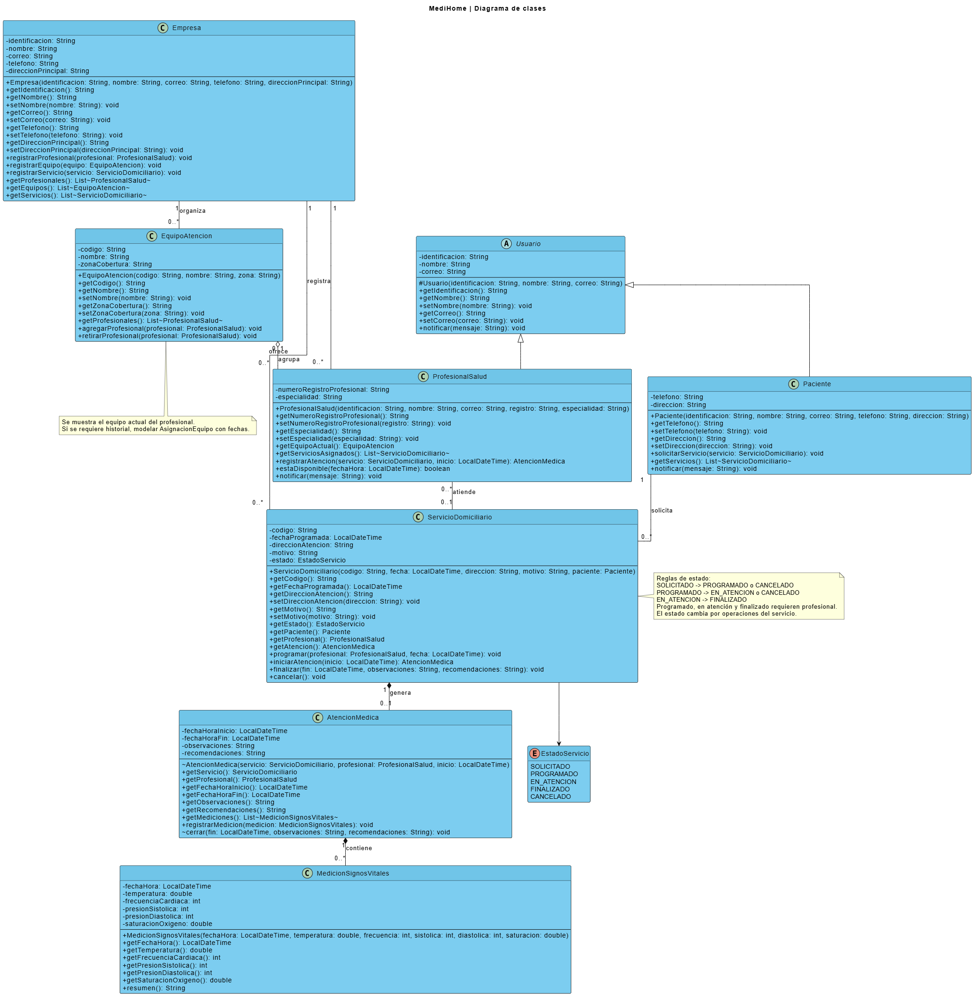

# MediHome — servicios médicos domiciliarios

Taller de Diseño y Programación. Aplicación de consola en Java para administrar un ejemplo del flujo de atención domiciliaria y emitir el reporte clínico del servicio.

## Participantes

- Daniel Chaux
- Sebastian Granda

## Diagrama de clases



- Imagen exportada desde VPasCode, herramienta de diagramas de Visual Paradigm: [`diagrama/Medihome-Clases.png`](diagrama/Medihome-Clases.png)
- Fuente editable PlantUML: [`diagrama/Medihome-Clases.puml`](diagrama/Medihome-Clases.puml)
- Proyecto Visual Paradigm (`.vpp`): pendiente de guardar desde VP Desktop/VP Online.

## Modelo

El modelo incluye `Empresa`, `Usuario`, `Paciente`, `ProfesionalSalud`, `EquipoAtencion`, `ServicioDomiciliario`, `AtencionMedica`, `MedicionSignosVitales` y el enum `EstadoServicio`.

- `Paciente` y `ProfesionalSalud` son especializaciones de `Usuario`; cada tipo implementa las notificaciones que recibe.
- `EquipoAtencion` agrupa profesionales. La asociación mantiene el equipo actual y permite cambiarlo sin eliminar al profesional.
- Un paciente solicita varios servicios; cada servicio corresponde a un paciente y puede tener un profesional asignado al programarse.
- `AtencionMedica` depende del servicio que la origina y `MedicionSignosVitales` depende de su atención; ambas relaciones se representan con composición.
- El estado del servicio cambia mediante operaciones que validan el flujo `SOLICITADO → PROGRAMADO → EN_ATENCION → FINALIZADO`, con cancelación antes de iniciar la atención.
- Los atributos se mantienen privados y las colecciones se exponen como listas no modificables para proteger el estado.

## Ejecutar

Requiere Java 17 o posterior. Desde la carpeta raíz del proyecto:

```powershell
javac -encoding UTF-8 -d out src/main/java/medihome/*.java
java -cp out medihome.Main
```

`Main` construye una empresa, paciente, profesional, equipo, servicio, atención y medición de signos vitales. Luego muestra el reporte y envía una notificación de ejemplo al paciente. Los datos son ficticios y no se guardan en una base de datos.
